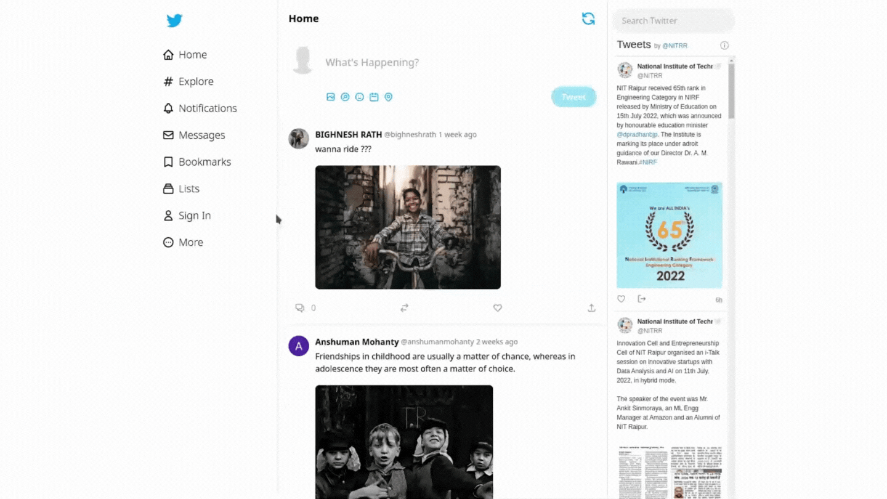
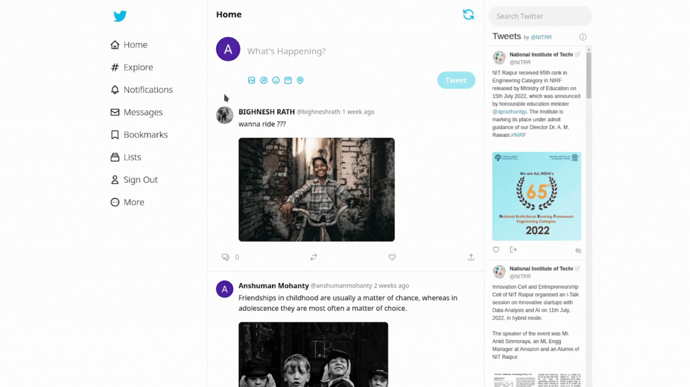
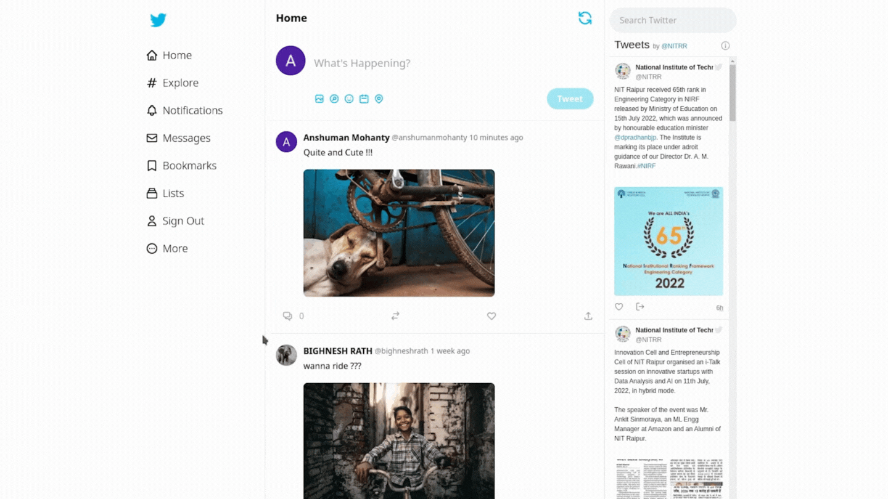

<p align="center">
  <a>
    <h1 align="center">Twitter Clone using <a href="https://nextjs.org/">Next.js</a> and <a href="https://www.sanity.io/">Sanity.io</a></h1>
  </a>
</p>


<p align="center">
This Website is built using Next.js with TailwindCSS and Sanity.io as my CMS(Content Management System). Used NextAuth to implement Signin Feature.</br></br>
</p>

# Sign In Feature



# Tweet Feature



# Comment Feature



# Fully Reponsive 


# Fully Functional Comment Feature
>On Submission, the Comment goes straight to the Sanity CMS and get logged there.
> 


>Here we can see, the Stored Comments on Sanity CMS. 
> 


>To show the comment on the Blog page, we(moderator) have/has to approve the comment.  
> 


>Voila!!! Our Comment is Live on the Blog Page.
> 


## Getting Started with Next.js

Visit <a aria-label="next.js learn" href="https://nextjs.org/learn">https://nextjs.org/learn</a> to get started with Next.js.

- To run the Next.js Server : 
<code>npm run dev</code>


## Getting Started with Sanity.io

- To run the Sanity Dashboard : 
<code>cd anshumanblogapp</code> then
 <code>sanity start</code>
 
 - To Install Sanity Studio : 
<code>cd anshumanblogapp</code> then
 <code>sanity deploy</code>

# Next.js + Tailwind CSS Example

This example shows how to use [Tailwind CSS](https://tailwindcss.com/) [(v3.0)](https://tailwindcss.com/blog/tailwindcss-v3) with Next.js. It follows the steps outlined in the official [Tailwind docs](https://tailwindcss.com/docs/guides/nextjs).

## Deploy your own

Deploy the example using [Vercel](https://vercel.com?utm_source=github&utm_medium=readme&utm_campaign=next-example) or preview live with [StackBlitz](https://stackblitz.com/github/vercel/next.js/tree/canary/examples/with-tailwindcss)

[](https://vercel.com/new/git/external?repository-url=https://github.com/vercel/next.js/tree/canary/examples/with-tailwindcss&project-name=with-tailwindcss&repository-name=with-tailwindcss)

## How to use

Execute [`create-next-app`](https://github.com/vercel/next.js/tree/canary/packages/create-next-app) with [npm](https://docs.npmjs.com/cli/init), [Yarn](https://yarnpkg.com/lang/en/docs/cli/create/), or [pnpm](https://pnpm.io) to bootstrap the example:

```bash
npx create-next-app --example with-tailwindcss with-tailwindcss-app
# or
yarn create next-app --example with-tailwindcss with-tailwindcss-app
# or
pnpm create next-app --example with-tailwindcss with-tailwindcss-app
```

Deploy it to the cloud with [Vercel](https://vercel.com/new?utm_source=github&utm_medium=readme&utm_campaign=next-example) ([Documentation](https://nextjs.org/docs/deployment)).
